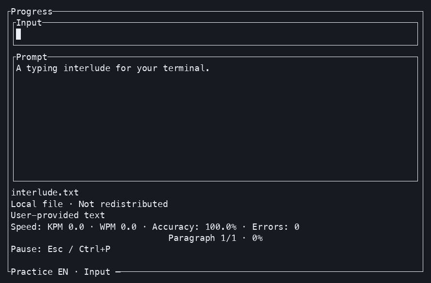

<h1 align="center">Typerlude</h1>

<p align="center"><strong>A typing interlude for your terminal.</strong></p>

<p align="center">
  <a href="https://github.com/baba9811/typerlude/actions/workflows/ci.yml"></a>
  <a href="https://www.npmjs.com/package/typerlude"></a>
  <a href="https://crates.io/crates/typerlude"></a>
  <a href="https://github.com/baba9811/typerlude/releases"></a>
  <a href="LICENSE"></a>
</p>

<p align="center"><strong>English</strong> · <a href="README.ko.md">한국어</a></p>

<p align="center">
  
</p>

Practice Korean and English typing—or take a quick interlude when vibe coding gets quiet.
Typerlude runs in your terminal, works offline, and keeps your practice data local.

## Install

| npm · Node.js 18+ | Cargo · Rust 1.88+ |
| --- | --- |
| `npm install -g typerlude` | `cargo install typerlude` |

Then launch it:

```bash
typerlude
```

Use a UTF-8 interactive terminal. The recommended minimum size is 80×24.

## Quick start

Pick a mode, adjust its options, and press `Enter`. Use `Tab`, arrow keys, `j`, or `k` to move;
`Esc`, `q`, or `ㅂ` go back, and the same keys quit from Home. During active practice, `Esc`
pauses or opens leave confirmation while `q` and `ㅂ` remain typing input. In Word practice,
`Space` or `Enter` submits the current word.

Practice your own text from a file or standard input:

```bash
typerlude notes.txt
cat notes.txt | typerlude
```

Consecutive blank lines in file and stdin text are collapsed before practice.

Paste is ignored during scored practice.

## Games

### Word Rain

Choose Korean or English and Easy, Medium, Hard, or Hell for an endless run. Words fall faster every
ten clears, and the first word to reach the miss line ends the game. A typo stays editable: use
`Backspace`, or erase the input completely to target a different word. `Esc` pauses and pressing `q`
or `ㅂ` twice while paused leaves. On the result screen, `r` or `ㄱ` retries; `Enter` or `Esc` returns
to Games. Hell starts with a 7.0-second fall time and a 1.2-second spawn interval.

### Boss Battle

Fight one of three bosses for 90 active seconds with three hearts. Each boss has its own typing
pattern and phase-two skill. Difficulties unlock Easy → Medium → Hard → Hell for each boss, while
clearing Easy also opens the next boss. `☆☆☆ ✧` through `★★★ ✦` shows the highest clear. On the
result screen, `r` or `ㄱ` retries; `Enter` or `Esc` returns to the selected boss's options.

See the [Boss Battle guide](https://github.com/baba9811/typerlude/blob/main/docs/games/boss-battle.md)
for the boss roster, mechanics, progression, and scoring rules.

## What you get

- Quick, Keys, Words, Sentences, Long Text, and timed Test modes
- Two offline games: escalating one-miss Word Rain and three-boss Boss Battle
- Korean and English UI, content, scoring, and speed units
- Unicode-aware typing metrics, goals, history, progress, and weak-key practice
- Built-in offline content plus local content packs and themes
- No account, telemetry, ads, or cloud storage

## Useful commands

| Command | Purpose |
| --- | --- |
| `typerlude stats` | Open statistics |
| `typerlude history` | Open session history |
| `typerlude themes` | Choose a theme |
| `typerlude paths` | Print every local data path |
| `typerlude licenses` | Print offline license notices |
| `typerlude update` | Check for a newer release |
| `typerlude --help` | Show CLI help |

## Privacy and local data

Your custom text stays in memory and is never copied into session history. Saved sessions contain
aggregate metrics and intended-key counts—not what you typed. Configuration, sessions, content,
themes, and the update cache use your operating system's standard user directories; run
`typerlude paths` to see the exact locations.

Game runs are not added to session history. Word Rain best scores are saved for each language and
difficulty. Boss Battle clear stars are shared between languages, while best scores are saved for
each boss, language, and difficulty.

## Contributing

Bug reports, feature ideas, and focused pull requests are welcome. Start with
[CONTRIBUTING.md](https://github.com/baba9811/typerlude/blob/main/CONTRIBUTING.md) and follow the
[Code of Conduct](https://github.com/baba9811/typerlude/blob/main/CODE_OF_CONDUCT.md).

## Project links

- [Content-pack guide](https://github.com/baba9811/typerlude/blob/main/docs/content-packs.md) · [콘텐츠 팩 안내](https://github.com/baba9811/typerlude/blob/main/docs/content-packs.ko.md)
- [Security policy](https://github.com/baba9811/typerlude/blob/main/SECURITY.md)
- [Releases](https://github.com/baba9811/typerlude/releases) · [Release guide](https://github.com/baba9811/typerlude/blob/main/docs/releasing.md)
- [License](LICENSE) · [Third-party and content notices](THIRD_PARTY_NOTICES.md)

## Development

```bash
git clone https://github.com/baba9811/typerlude.git
cd typerlude
cargo run --
make test
```

Original Typerlude source code is MIT-licensed. Project-authored practice data is CC0; bundled
third-party content and dependencies retain their own terms. See [LICENSE](LICENSE) for details.
